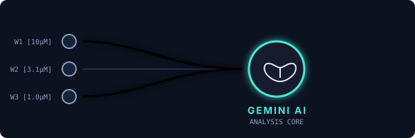
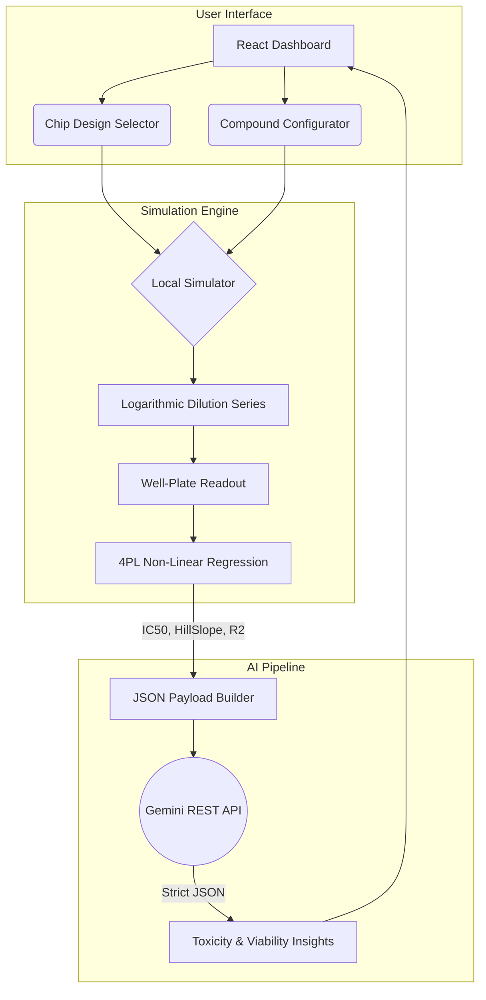

<p align="center">
  
</p>

<h1 align="center">
  
</h1>

<p align="center">
  <strong>Advanced Biological Data Modeling & LLM-Driven Toxicity Analysis</strong>
</p>

<p align="center">
  
  
  
  
  
</p>

<hr />

## 📖 Table of Contents
1. [Overview](#-overview)
2. [Microfluidic Chip Paradigms](#-microfluidic-chip-paradigms)
3. [Mathematical Modeling (Hill Equation)](#-mathematical-modeling)
4. [AI Integration Engine](#-ai-integration-engine)
5. [System Architecture](#%EF%B8%8F-system-architecture)
6. [Local Development](#-quick-start--local-development)

---

## 🚀 Overview

**Microflow AI** is a state-of-the-art simulation platform for evaluating drug dose-response curves through virtual **Organ-on-Chip (OoC)** microfluidic networks. It bridges the gap between biological assay simulations and large language models (LLMs), utilizing **Google's Gemini AI** to interpret viability metrics, morphology scores, and compute toxicity risks in real-time.

By visualizing complex fluidic mixing geometries and abstracting their outputs into standardized pharmacological readouts, Microflow AI accelerates virtual drug screening and compound prioritization.

---

## 🧪 Microfluidic Chip Paradigms

Physical microfluidic designs drastically dictate fluidic resistance and advective mixing efficiency in reality. Microflow AI allows you to visualize fluidic mixing across 5 distinct microfluidic chip paradigms while standardizing the output gradient to a 6-point logarithmic scale for 1-to-1 biological comparability.

| Chip Design | Fluidic Characteristics | Biological Use-Case |
| :--- | :--- | :--- |
| **Smooth Serpentine** | Long-path advection & diffusion mixing. | Establishing continuous, extremely smooth gradients. |
| **Linear Manifold** | High-throughput structural bus. | Rapid mixing with discrete vertical drop aliquots. |
| **Radial Hub** | Centrifugal fluidics vortex. | Simultaneous, equal-pressure droplet dispensing. |
| **Christmas Tree** | Successive Whitesides splitting. | Generating highly precise logarithmic profiles. |
| **Legacy Serpentine** | Classic orthogonal-channel model. | Simple fabrication relying on chaotic advection. |

---

## 📐 Mathematical Modeling

Under the hood, Microflow AI computes dose-response curves using a locally executed non-linear regression fit. It applies the **4-Parameter Logistic (4PL) Hill Equation** to calculate the half-maximal inhibitory concentration ($IC_{50}$).

$$ Viability(\%) = Bottom + \frac{Top - Bottom}{1 + 10^{(LogIC_{50} - X) \times HillSlope}} $$

- **Top:** Constrained to 100% (Baseline Control Viability)
- **Bottom:** The maximal kill plateau of the compound
- **HillSlope:** The steepness of the dose-response transition
- **X:** Logarithmic concentration of the drug

These mathematically derived metrics ($IC_{50}$, $R^2$, $HillSlope$) are treated as Ground Truth and fed into the AI Integration Engine.

---

## 🤖 AI Integration Engine

<p align="center">
  
</p>

Microflow AI acts as a sophisticated prompt-engineering pipeline. Instead of forcing the LLM to do mathematical regressions (which LLMs struggle with), the app computes the math locally and passes the structured analytical payload to **Gemini 3.6 Flash**.

**The AI evaluates:**
1. Curve morphology (steepness and plateau depths)
2. Statistical fit quality ($R^2$ penalty scoring)
3. Biological toxicity context based on compound class

It returns a strict JSON payload containing a Risk Assessment (Low/Moderate/High), Confidence Score, and human-readable recommendations for advancing or deprioritizing the compound.

---

## 🏗️ System Architecture



---

## 🛠️ Quick Start & Local Development

Clone the repository and install dependencies using npm or yarn:

```bash
# 1. Clone the repo
git clone https://github.com/alokojhaui/microflow-ai.git
cd microflow-ai

# 2. Install dependencies
npm install

# 3. Start the development server
npm run dev
```

### Environment Variables
To enable the Gemini AI integration, you must add an API key inside the app's secure key panel in the browser, or create a `.env` file at the root of the project:

```env
VITE_GEMINI_API_KEY=your_gemini_api_key_here
```

---
<p align="center"><i>Built for the future of in-silico screening.</i></p>
